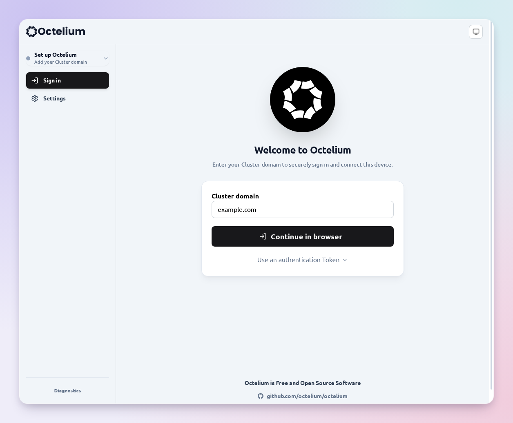
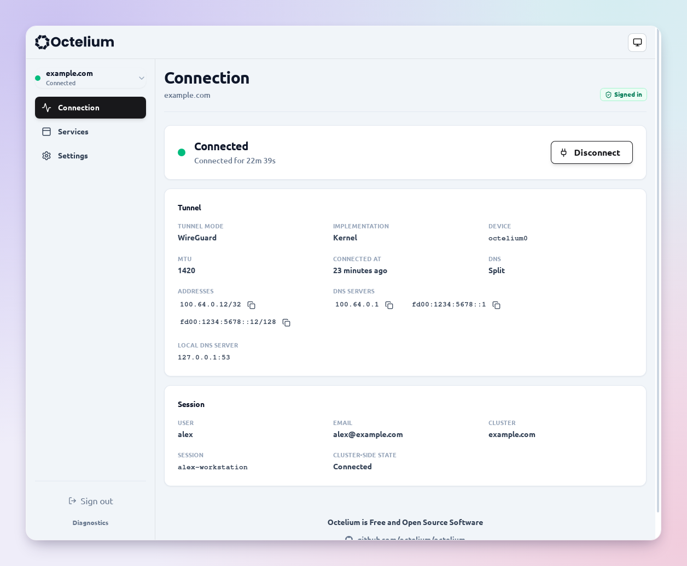
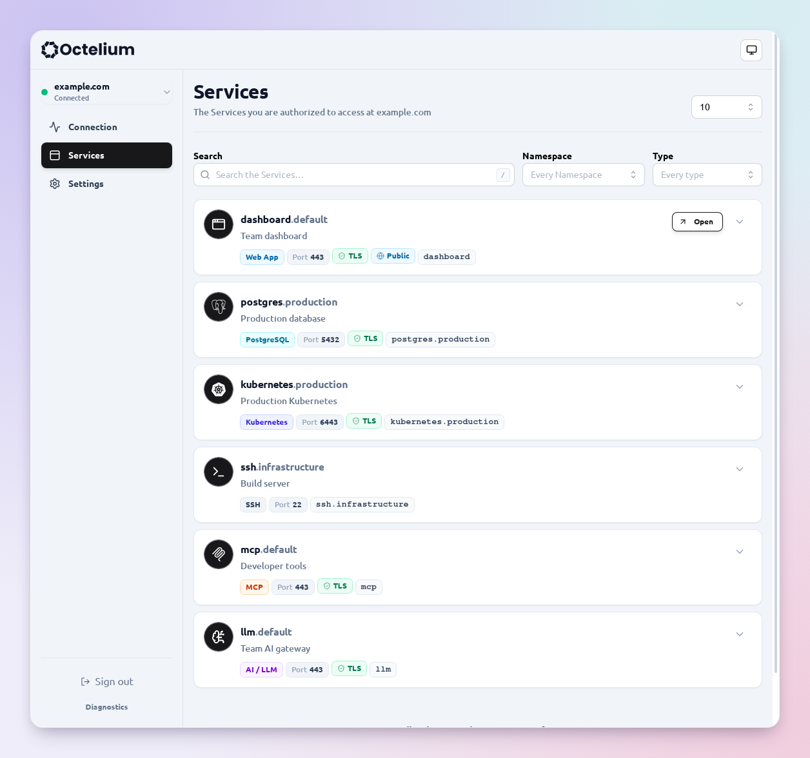
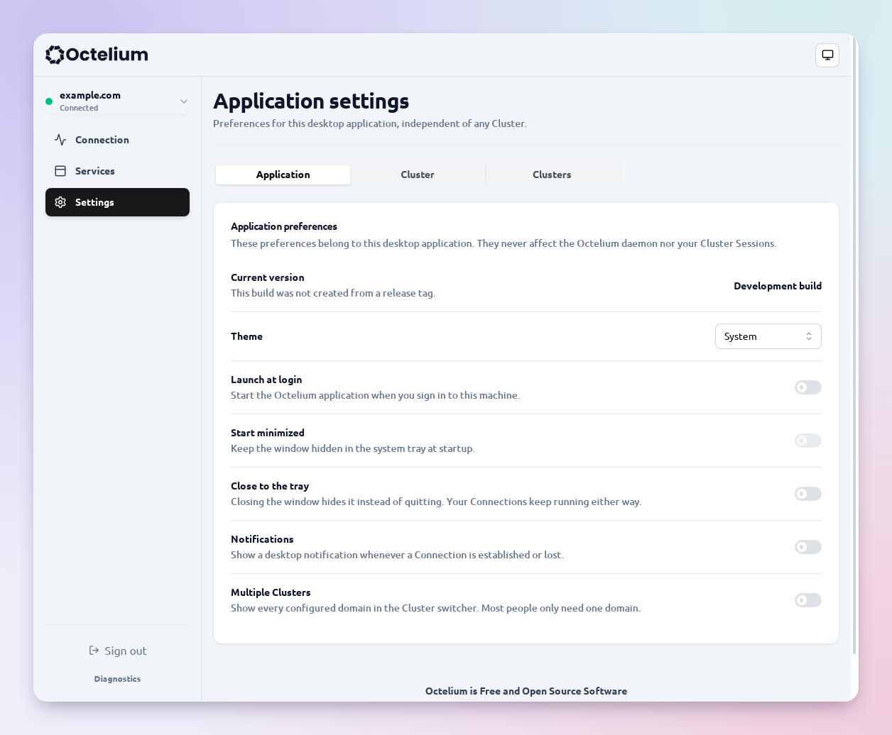
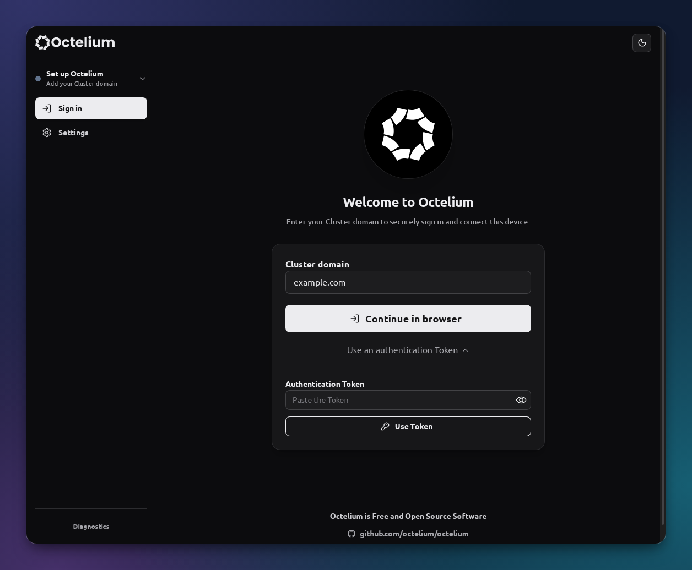
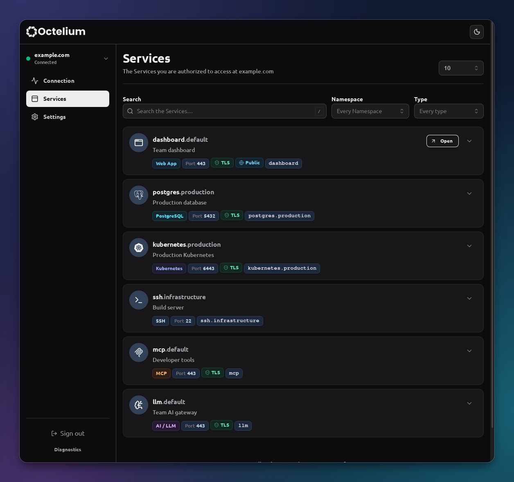

# Octelium Desktop

The [Octelium](https://github.com/octelium/octelium) desktop app for Linux, macOS and Windows.

## Screenshots

Native app screenshots with `example.com` demo data.

| Sign in | Connection |
| --- | --- |
| [](unsorted/login-light.png) | [](unsorted/connection-light.png) |
| **Services** | **Settings** |
| [](unsorted/services-light.png) | [](unsorted/settings-application-light.png) |
| **Sign in (dark)** | **Services (dark)** |
| [](unsorted/login-token-dark.png) | [](unsorted/services-dark.png) |

## Download

[Download Octelium Desktop](https://github.com/octelium/octelium-desktop/releases/).

## Build from source

Requires Node.js, Rust and the [Tauri prerequisites](https://v2.tauri.app/start/prerequisites/).

```bash
npm install
npm run build
npm run tauri build -- --no-bundle
```

Run the executable in `src-tauri/target/release/` with an Octelium daemon running.

## License

Apache License 2.0. See [LICENSE](LICENSE).
